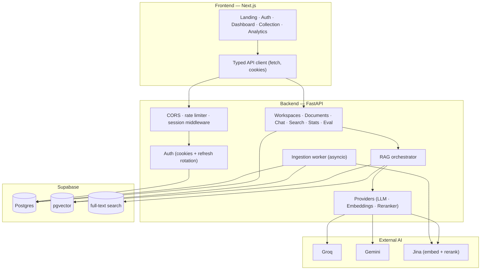
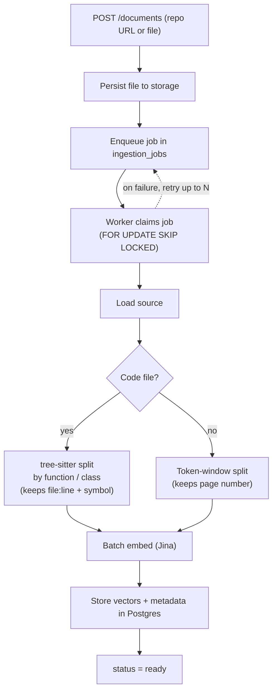
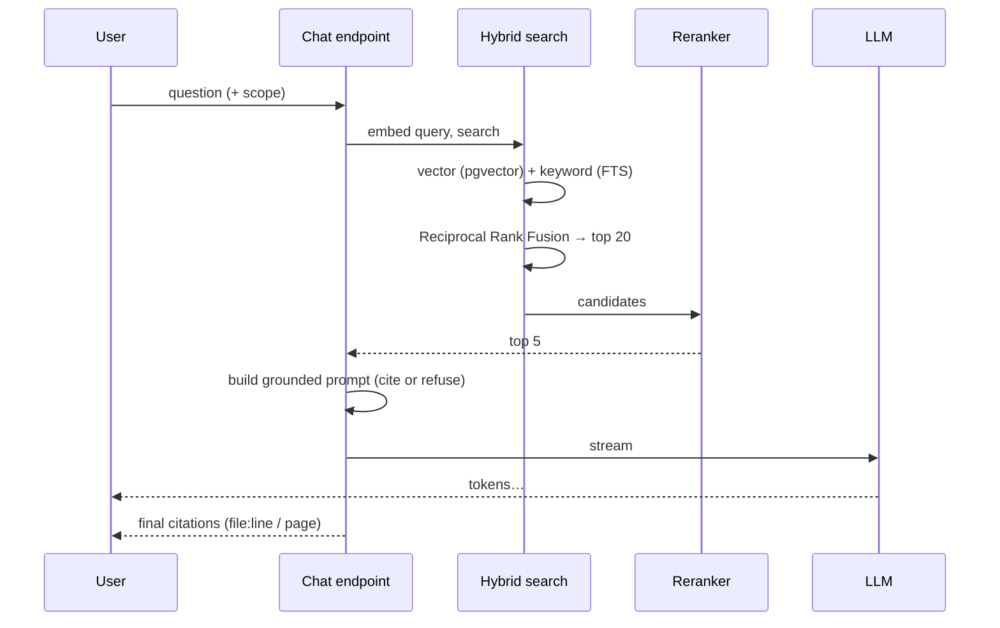
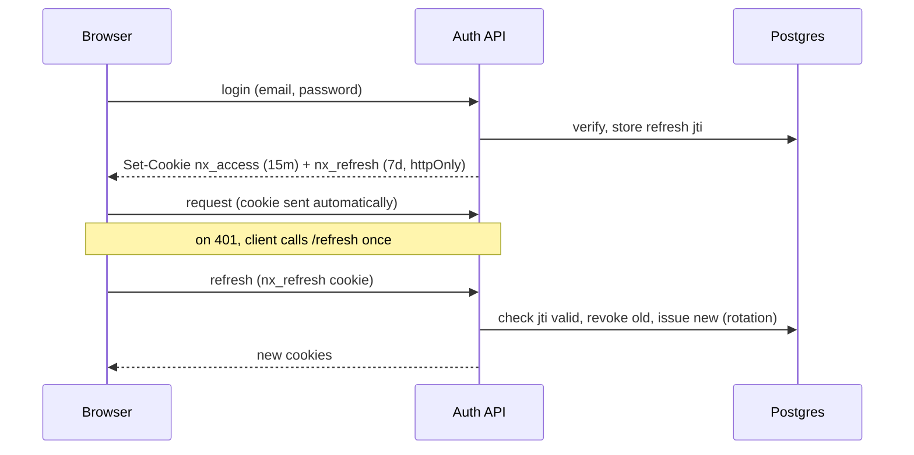
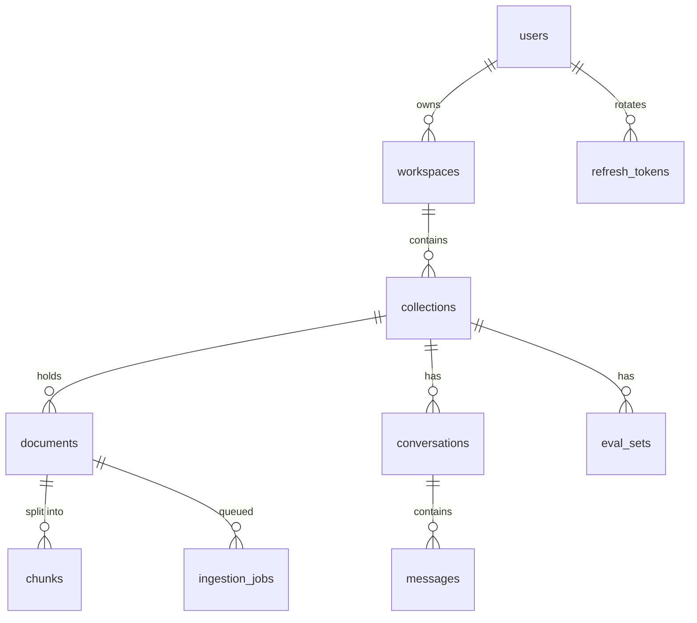

# Architecture

A closer look at how Nexus AI is put together.

## System overview

## Ingestion

A source (repo or file) becomes searchable through a durable, retrying pipeline.

Key points:
- **Structure-aware chunking** is what makes citations meaningful — a chunk is a
  whole function or class with its real line range, not an arbitrary slice.
- Jobs live in Postgres, so a restart mid-index doesn't lose work; the worker
  just picks them back up and retries.
- Files are persisted through a storage interface (local disk today, swappable
  for S3 / Supabase Storage).

## Retrieval and answering

The prompt tells the model to answer only from the provided context, cite each
claim, and explicitly refuse when the answer isn't there — which is why an
off-topic question returns "I don't have enough information" instead of a
hallucination.

## Auth

Sessions are cookie-based, not token-in-localStorage.

- Access and refresh tokens are **httpOnly** — JavaScript never sees them.
- Refresh tokens are **single-use**; reusing a rotated token is rejected.
- Auth endpoints are rate-limited; CORS is locked to the frontend origin.

## Data model (core tables)

`chunks` carries the vector (`vector(1024)`), a generated `tsvector` for keyword
search, and JSON metadata (file path, line range, page, symbol name) that powers
citations and the knowledge map.
