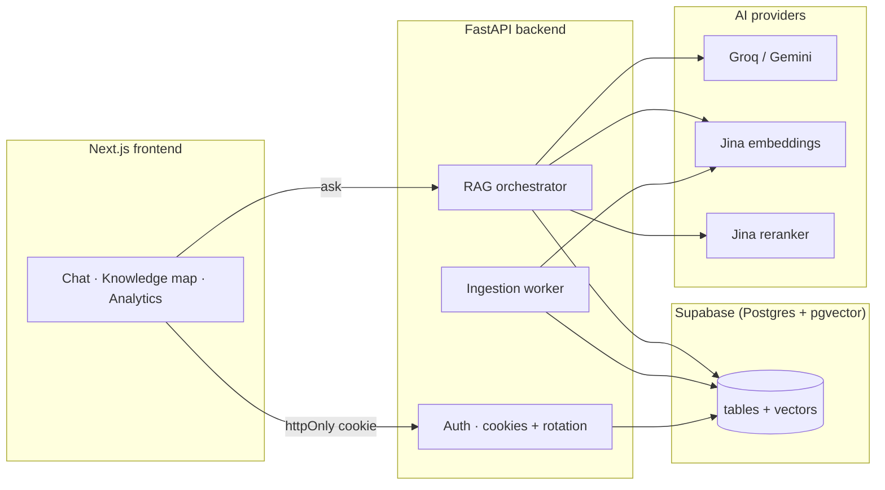
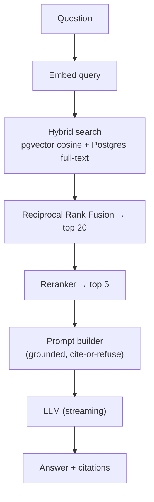

# Nexus AI

Upload anything, ask anything, and watch the AI actually think.

Nexus AI is a retrieval-augmented knowledge platform. You point it at GitHub
repositories and documents, it indexes everything, and then you can chat with it
and get answers grounded in your own sources — with citations back to the exact
file, line, or page. No hand-wavy "the AI said so." Every claim links to where it
came from.

I built this to go past the usual "chat with your PDF" demo. Under the hood it's
a real RAG pipeline (structure-aware chunking, hybrid search, reranking, an
evaluation harness) wrapped in an interface that visualizes what's happening
instead of hiding it behind a spinner.

---

## What it does

- **Chat with your knowledge base** — grounded, streaming answers with inline
  citations. If the answer isn't in your sources, it says so instead of making
  something up.
- **Index GitHub repos and documents** — paste a repo URL or drop a PDF / DOCX /
  Markdown / text file. Code is split by function and class (not blindly by
  character count), so citations point at real symbols and line ranges.
- **Hybrid retrieval + reranking** — keyword search and vector search are fused
  with Reciprocal Rank Fusion, then a reranker keeps only the best chunks.
- **Click a citation → open the file** — jumps straight to the source with the
  cited region highlighted.
- **A knowledge map** of every file in a repo, plus a live analytics view.
- **Multi-tenant** — each account gets its own private workspace and collections.
- **An evaluation harness** — a set of question/answer pairs scored for retrieval
  recall, faithfulness, and answer correctness, so quality is measurable, not a guess.

The UI is dark, animated, and deliberately over-the-top: a particle "knowledge
core" on the landing page, a pipeline animation that lights up while a question
is being answered, glass panels, Ctrl+K spotlight search, and sound effects you
can mute.

---

## How it works



The RAG pipeline, end to end:



There's a deeper breakdown (ingestion, retrieval, auth) in
[ARCHITECTURE.md](ARCHITECTURE.md).

---

## Stack

| Layer | Choice |
|---|---|
| Backend | Python, FastAPI, SQLAlchemy (async), Alembic |
| Frontend | Next.js (App Router), TypeScript, Tailwind, Three.js / React Three Fiber, Motion |
| Database | Supabase — Postgres + `pgvector` + full-text search |
| Generation | Groq (`qwen`, `gpt-oss`, `llama`) with a Gemini fallback |
| Embeddings | Jina `jina-embeddings-v3` (1024-dim) |
| Reranking | Jina reranker v2 |

Everything runs on free API tiers, and nothing needs Docker.

---

## Getting started

### 1. Prerequisites

- Python 3.10+
- Node.js 18+
- A free [Supabase](https://supabase.com) project
- Free API keys: [Groq](https://console.groq.com), [Jina](https://jina.ai),
  and optionally [Google AI Studio](https://aistudio.google.com/apikey) for Gemini

### 2. Configure

Copy the example env file at the repo root and fill it in:

```bash
cp .env.example .env
```

You'll need your Supabase **connection pooler** string (Session mode) as
`DATABASE_URL`, plus your API keys. See `.env.example` for every option.

### 3. Backend

```bash
cd backend
python -m venv .venv
# Windows: .venv\Scripts\activate   |   macOS/Linux: source .venv/bin/activate
pip install -r requirements.txt
alembic upgrade head          # creates all tables + enables pgvector
uvicorn app.main:app --port 8000
```

### 4. Frontend

```bash
cd frontend
npm install
# create .env.local with:  NEXT_PUBLIC_API_BASE=http://localhost:8000
npm run dev
```

Open http://localhost:3000.

### 5. Load demo data (optional)

Indexes a sample repo + a handbook document and seeds an eval set, so you have
something to chat with immediately:

```bash
cd backend
.venv/Scripts/python -m scripts.seed_demo     # or .venv/bin/python on macOS/Linux
```

Then sign in with **demo@nexus.ai / demo1234** and ask
*"How does the code load recruiters?"*

---

## Testing

```bash
cd backend
.venv/Scripts/python -m pytest
```

Unit tests cover the security helpers, rank fusion, structure-aware chunking, and
config handling.

---

## Project structure

```
backend/
  app/
    api/           # auth, workspaces, documents, chat, search, stats, eval
    ingestion/     # loaders + structure-aware chunking + pipeline
    retrieval/     # hybrid search + prompt builder
    rag/           # orchestrator (retrieve → rerank → answer)
    providers/     # LLM / embeddings / reranker behind one interface
    jobs.py        # durable Postgres-backed ingestion queue
    storage.py     # object storage (local, swappable for S3)
  alembic/         # migrations
  scripts/         # seed_demo, eval runner, checks
  tests/
frontend/
  app/             # routes
  components/      # UI + Three.js core, knowledge graph, chat, etc.
  lib/             # typed API client
```

---

## Notes

- Auth uses httpOnly cookies with refresh-token rotation and rate-limited
  endpoints. Email verification and password reset are wired end to end; in
  development the links are logged to the console (plug in a real mail provider
  for production).
- The ingestion worker runs inside the API process — simple and dependency-free,
  which is perfect for a single instance. Moving it to a separate worker + Redis
  is the natural scale-up path.

## License

MIT
